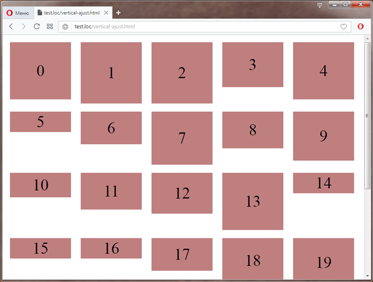
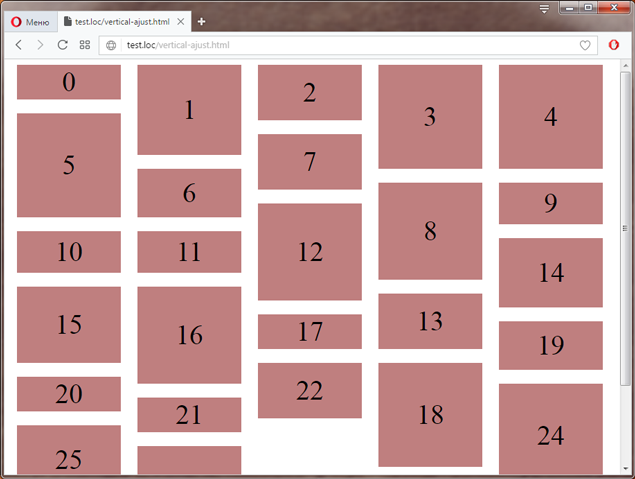

# jQuery-vertical-ajust
jQuery vertical ajustment plugin

If you need ajust this list:



to this one:



## STEP 1 - get a plugin

Attach plugin to the header of your html code. And of course don't forget to include jQuery library.

```html
<html>
<header>
   <script src="https://ajax.googleapis.com/ajax/libs/jquery/1.11.3/jquery.min.js"></script>
   <script src="jquery.verticalAjust.js"></script>
</header>
...
```

## STEP 2 - define your list

```html
<div class="list">
	<div class="item"></div>
	<div class="item"></div>
	<div class="item"></div>
	<div class="item"></div>
	<div class="item"></div>
	<div class="item"></div>
	<div class="item"></div>
</div>

<style>
.item {
	/* inline blocks with same width */
	width: 150px;
	display: inline-block; /* important! */
	vertical-align: top; /* important! */
	
  /* few css lines for make-up */
	height: 100px;
	margin: 10px;
	text-align: center;
	background: rgba(0, 128, 0, 0.5);
	font-size: 40px;
}
</style>

<script>

	(function ($) {
		/*	Prepare example list:
		    Add random height and number labels.
		*/
		
		$(".item").each(function(index) {
			var ht = getRandomInt(5, 15) * 10;
			$(this).css({'height' : ht, 'lineHeight' : ht + 'px' }).html(index);
		});
	
		function getRandomInt(min, max)	{
			return Math.floor(Math.random() * (max - min + 1)) + min;
		}
	}) (jQuery);

</script>
```
## STEP 3 - attach ajustive behaviour by plugin

```javascript
<script>
(function ($) {
   /* plugin usage */
   $.fn.verticalAjust('attach', '.list .item');
}) (jQuery);
</script>
'''
